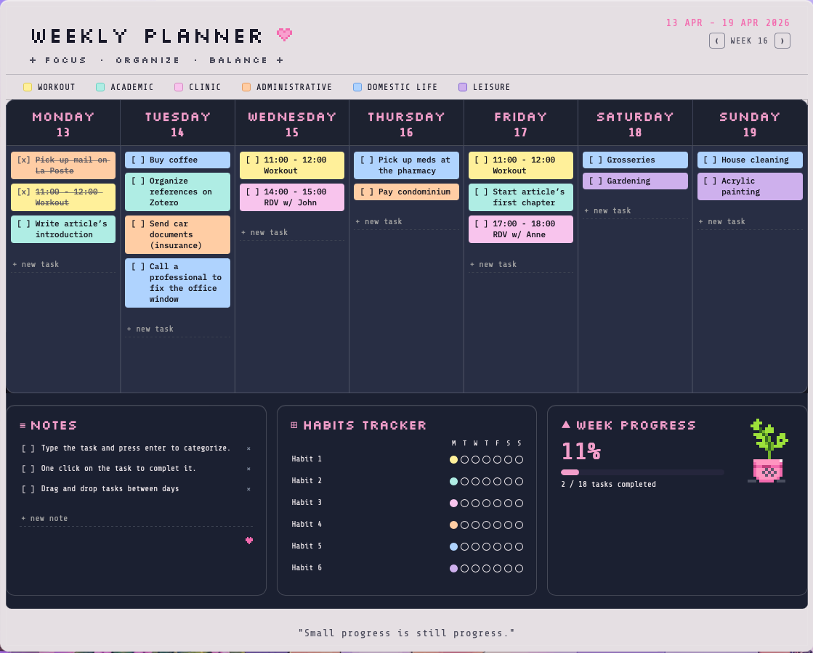

# weekly-planner-widget
Retro-inspired weekly planner with task categories, habit tracking and local data persistence.

## Preview

# Weekly Planner Widget

A retro-inspired weekly planning widget designed to support organization, focus, and work-life balance.

Created by Gabriella Binde as a personal software project combining productivity design, behavioral organization, and interactive user interfaces.

## Overview

This project is a fully interactive weekly planner that allows users to:

* Organize tasks by day of the week
* Categorize activities across life domains
* Track habits throughout the week
* Monitor weekly completion progress
* Store data locally without requiring external databases
* Navigate between past and future weeks
* Manage notes and reminders in a unified workspace

All information is automatically saved through browser local storage, creating a lightweight and self-contained planning system.

## Features

### Weekly Task Board

* Seven-day planning layout
* Task creation and editing
* Task completion tracking
* Drag-and-drop task reordering
* Week navigation

### Task Categories

Tasks can be assigned to six domains:

| Category       | Description                           |
| -------------- | ------------------------------------- |
| Clinic         | Clinical activities                   |
| Academic       | Study and research                    |
| Workout        | Physical activity                     |
| Administrative | Bureaucratic and organizational tasks |
| Domestic Life  | Household responsibilities            |
| Leisure        | Recreation and free time              |

The color-coded system helps visualize balance across life domains.

### Habit Tracker

The planner includes a customizable habit tracking system:

* Up to six habits
* Daily completion tracking
* Weekly overview
* Visual feedback

### Notes Section

* Free-form note taking
* Completion checkboxes
* Quick editing and deletion

### Progress Dashboard

The widget automatically calculates:

* Total tasks
* Completed tasks
* Weekly completion percentage

allowing users to monitor overall productivity during the week.

## Technical Features

### Front-End

* JavaScript
* JSX / React-style components
* CSS-in-JS styling

### Data Persistence

* Browser localStorage
* No external database required

### User Interaction

* Keyboard shortcuts
* Drag-and-drop functionality
* Editable fields
* Dynamic rendering

### Design

* Retro pixel-art aesthetic
* Custom color palette
* Responsive task categorization system
* Custom pixel illustrations

## Motivation

As a psychologist and cognitive science student, I am interested in designing digital tools that support organization, executive functioning, habit formation, and self-management.

This project was developed both as a programming exercise and as an exploration of how interface design can facilitate everyday planning and productivity.

## Future Improvements

Planned features include:

* Data export
* Cloud synchronization
* Monthly view
* Statistics dashboard
* Custom themes
* Mobile adaptation

## Author

**Gabriella Binde**

Psychologist | Cognitive Science Student

